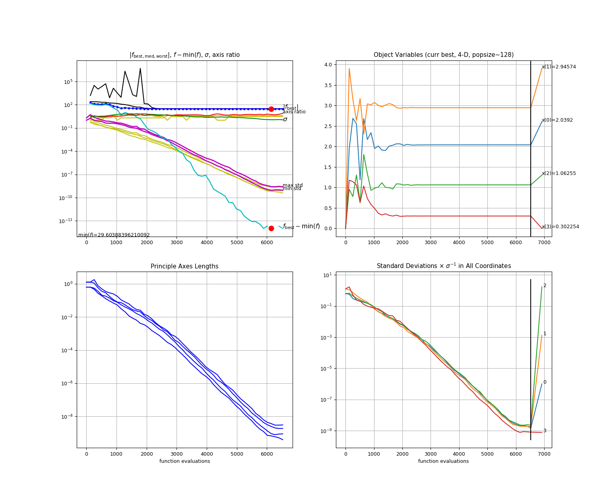

# Optimization
In this example we will show how to compute the maximum a posteriori estimate of the posterior distribution in an uncertainty quantification problem. First, we will create synthetic data using the model,

$$
f(t;\varphi) = \varphi_1 \sin(\varphi_2  x + \varphi_3 )
$$

We fix $\varphi^* = (2,3,1)$ and create $100$ data point using the equation,

$$
d_i = f(x_i,\varphi^{\star}) + \sigma \epsilon, \quad \epsilon \sim \mathcal{N}(0,1) \, ,
$$

where $x_i = 0.02 i,\; i=1,\ldots,100$ and $\sigma=0.3$. We will sample the posterior distribution of $\vartheta=(\varphi,\sigma)$ conditioned on the data $d$. The prior distribution is uniform for each parameter,

\begin{align}
    p(\vartheta_1) &= \mathcal{U}( \vartheta_1 | 0,5) \\
    p(\vartheta_2) &= \mathcal{U}( \vartheta_2 | 0,10) \\
	p(\vartheta_3) &= \mathcal{U}( \vartheta_3 | -3.14,3.14) \\
	p(\vartheta_4) &= \mathcal{U}( \vartheta_4 | 0,5)  \, ,
\end{align}

and the likelihood function in given by,

\begin{align}
    p(d | \vartheta) & = \prod_{i=1}^4 p(d_i | \vartheta) \\
					 &=  \prod_{i=1}^4 \mathcal{N}( d_i | f(x;\varphi),\sigma ) \, .
\end{align}


Finally, we want to compute,
$$
\vartheta^\star = \mathop{\arg\max}\limits_{\vartheta} \,\, p( \vartheta | d) \,.
$$


## Optimizing with CMA-ES
In this example we will use the [Covariance Matrix Adaptation - Evolution Strategy](https://arxiv.org/pdf/1604.00772.pdf) (CMA-ES) algorithm in order to optimize the posterior distribution.

### Compile and run

From the base folder run
```sh
cd build
make cmaes_theta_internal
```

Make sure that `use_torc=0` and `use_omp=0` in the Makefile since we don't want to run parallel in this example. Go back to the the base folder and run

```sh
cd ../examples/optimization/internal/
./setup_fast_optimize.sh.sh
cd runs/run_001/
```

Run the CMA-ES optimization algorithm:
```sh
./cmaes_theta_internal
```

The output in the terminal will look like this:


Notice that the algorithm has converged to
```
2.0392035199474865  2.9457365262310957  1.0625543252360856  0.3022538646514062
```
and compare these values to the nominal value $\vartheta^* = (2,3,1,0.3)$ that we used to create the synthetic data.


Finally, visualize the samples:
```sh
cp ../../../../../source/tools/postprocessing_tools/cmaes/cmaplt.py .
python plotmatrix_hist.py final.txt
```




### Behind the scripts
The script `./setup_tmcmc.sh` makes a new running folder and copies inside the executable and the needed files:

1. the data file data.txt,
1. the file that contains the prior information, [priors.par](../developing/par_files.md#priors.par),
1. the parameter file for tmcmc, [tmcmc.par](../developing/par_files.md#tmcmc.par).

For this example, TMCMC has been linked to the likelihood function `loglike_theta_fast.c`. Inside this file the model $f$ as well as the likelihood function $p(d | \vartheta)$ has beem implemented. More information on the the likelihood implementation and how to write your own likelihood you can find [here](../developing/likelihoods.md).
