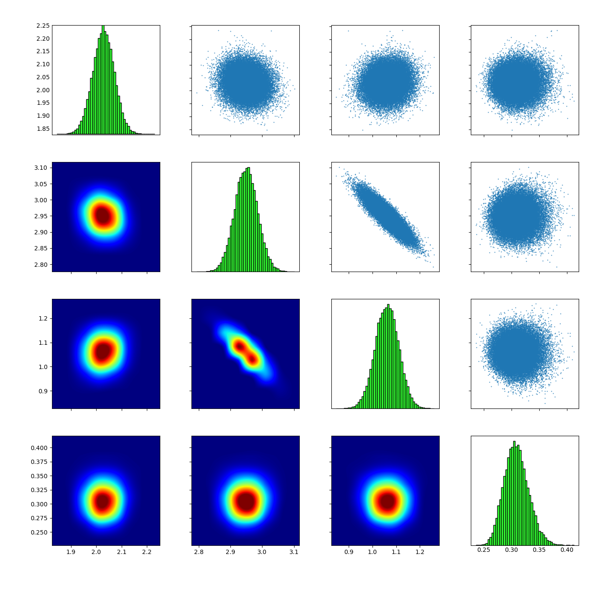
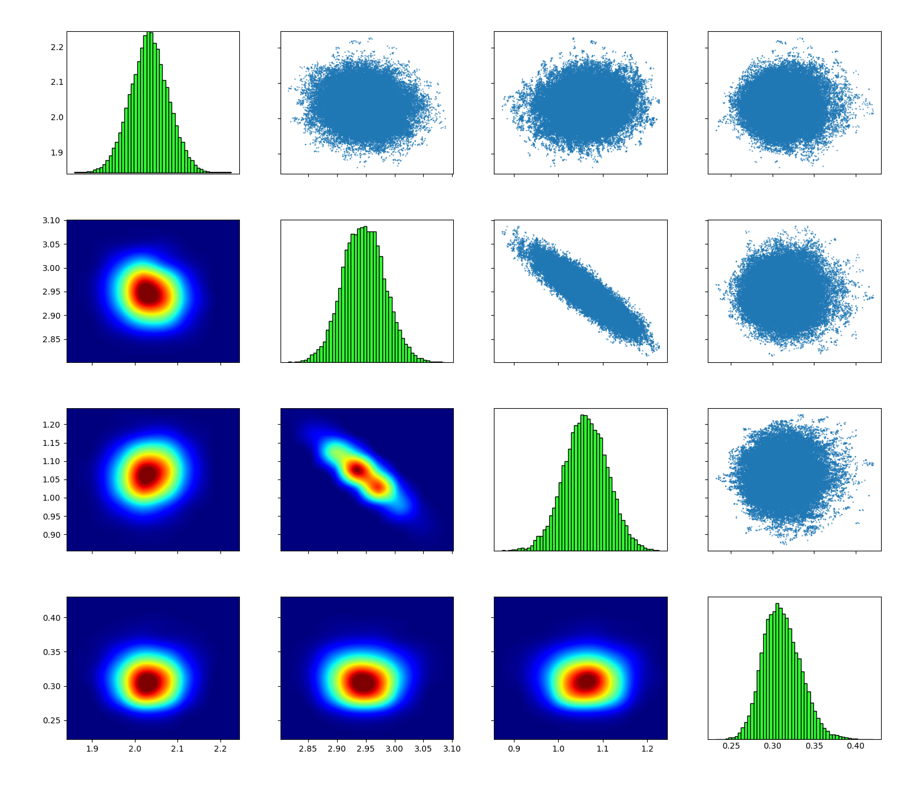

# Sampling a posterior distribution

In this example we will show how to sample the posterior distribution in an uncertainty quantification problem. First, we will create synthetic data using the model,

$$
f(x;\varphi) = \varphi_1 \sin(\varphi_2  x + \varphi_3 )
$$

We fix $\varphi^{\star} = (2,3,1)$ and create $100$ data point using the equation,

$$
d_i = f(x_i,\varphi^{\star}) + \sigma \epsilon, \quad \epsilon \sim \mathcal{N}(0,1) \, ,
$$

where $x_i = 0.02 i,\; i=1,\ldots,100$ and $\sigma=0.3$. We will sample the posterior distribution of $\vartheta=(\varphi,\sigma)$ conditioned on the data $d$. The prior distribution is uniform for each parameter,

\begin{align}
    p(\vartheta_1) &= \mathcal{U}( \vartheta_1 | 0,5) \\
    p(\vartheta_2) &= \mathcal{U}( \vartheta_2 | 0,10) \\
	p(\vartheta_3) &= \mathcal{U}( \vartheta_3 | -3.14,3.14) \\
	p(\vartheta_4) &= \mathcal{U}( \vartheta_4 | 0,5)  \, ,
\end{align}

and the likelihood function in given by,

\begin{align}
    p(d | \vartheta) & = \prod_{i=1}^{100} p(d_i | \vartheta) \\
					 &=  \prod_{i=1}^{100} \mathcal{N}( d_i | f(x;\varphi),\sigma ) \, .
\end{align}


## Sampling with TMCMC

Second, we will use the [Transitional Markov Chain Monte Carlo](https://ascelibrary.org/doi/10.1061/%28ASCE%290733-9399%282007%29133%3A7%28816%29) (TMCMC)  algorithm for the sampling of the posterior distribution of $\vartheta$.
### Compile and run

From the base folder run
```sh
cd build
make tmcmc_theta_internal
```

Make sure that we set `use_torc=0` and `use_omp=0` in the Makefile since we don't want to run the code in parallel.
In the build folder execute following commands in order to setup the example:

```sh
cd ../examples/sampling/internal/tmcmc/
./setup_tmcmc.sh
cd runs/run_001/
```

Run the TMCMC sampling algorithm:
```sh
./tmcmc_theta_internal
```

Finally, visualize the samples:
```sh
cp ../../../../../../source/tools/display/plotmatrix_hist.py .
python plotmatrix_hist.py final.txt
```




### Behind the scripts
The script `./setup_tmcmc.sh` creates new folders and copies the executable and the required files to target directory:

1. the data file data.txt containing $d_i$,
2. the file [priors.par](../developing/par_files.md#priors.par) that contains the prior information $p(\vartheta_i)$ (i.e number of prior distributions, distribution functions, function parameters),
3. the parameter file [tmcmc.par](../developing/par_files.md#tmcmc.par) for tmcmc (e.g. number of samples, max iterations, seed).

In this example, Korali has been linked to the file `loglike_theta_fast.c`. Inside this file you can find the model $f$ as well as the likelihood function $p(d | \vartheta)$. More information on the implementation of a likelihood can be found [here](../developing/likelihoods.md).


## Sampling with DRAM

### Compile and run

From the base folder run
```sh
cd build
make dram_theta_internal
```

Make sure that we set `use_torc=0` and `use_omp=0` in the Makefile since we don't want to run the code in parallel.
In the build folder execute following commands in order to setup the example:

```sh
cd ../examples/sampling/internal/dram/
./setup_dram.sh
cd runs/run_001/
```

Run the DRAM sampling algorithm:
```sh
./dram_theta_internal
```

Finally, visualize the samples:
```sh
cp ../../../../../../source/tools/display/plotmatrix_hist.py .
tail -n +1000 chain.txt > tmp
./plotmatrix_hist.py tmp
```
With the command `tail -n +1000 chain.txt` we discard the first $1000$ samples which we consider as the burn-in period.




### Behind the scripts
Similar to the TMCMC example above. The only difference is that instead of the tmcmc.par we use [dram.par](../developing/par_files.md#dram.par).
